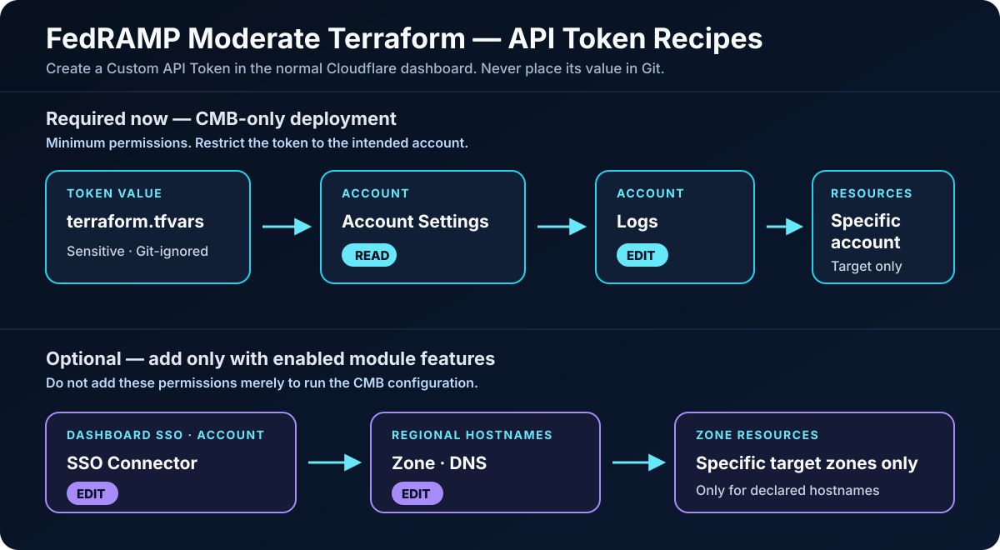

# Cloudflare FedRAMP Moderate onboarding

Terraform and operator gates for onboarding an existing Cloudflare public-platform account to FedRAMP Moderate.

> **Compliance boundary:** Terraform is only one part of onboarding. A successful apply does **not** make an account FedRAMP Moderate compliant. Complete `ONBOARDING-CHECKLIST.md` with your Cloudflare account team, including required entitlements, dashboard SSO, product-specific enablement, and customer responsibilities.

The self-contained permissions and apply-flow diagrams are linked from the [API token permissions](#api-token-permissions) section below.

## Expected foundation result

| Item | Expected result after a successful apply |
|---|---|
| Target account | Read from the ignored local `terraform.tfvars`; no customer identifier is committed |
| Cloudflare environment | Normal public platform — not the separate FedRAMP High environment |
| Customer Metadata Boundary | `us` |
| Out-of-region log access | `false` |
| Regional Hostnames | None until the customer explicitly enables and declares applicable hostnames |
| Dashboard SSO/FedRAMP warning | Not created until the customer enables and configures the feature |

Terraform reads the CMB values back from Cloudflare's API before the apply succeeds. The result describes an account setting, not a compliance certification.

## Architecture and control boundaries

- **Required path:** `terraform.tfvars` → Terraform → least-privilege token → public Cloudflare API → verified account → US Customer Metadata Boundary.
- **Required token scope:** Account Settings **Read** plus account-level Logs **Edit**, restricted to the target account.
- **Feature-gated path:** SSO Connector **Edit** and DNS **Edit** are needed only when dashboard SSO or Regional Hostnames are enabled.

FedRAMP Moderate does **not** move the customer into the separate FedRAMP High environment. It starts with an existing account on Cloudflare's normal public platform and then applies the required account entitlements, metadata boundary, SSO controls, subscriptions, and product-specific regionalization.

**Terminology:** the account-level setting configured here is **Customer Metadata Boundary (CMB)**, part of the Data Localization Suite. It is not named “C1.” **Cloudflare One** is Cloudflare's SASE platform (sometimes shortened internally as **CF1**) and is a product family whose Access, Gateway, Tunnel, and related controls may require separate FedRAMP Moderate onboarding steps.

Traffic can still enter Cloudflare through the public Anycast network. For applicable proxied services, Regional Services steers TLS termination and application-layer processing to the selected FedRAMP Moderate-certified locations. This is different from **FedRAMP High**, which has its own Cloudflare environment and authorized data-center boundary, dashboard, API, and client domains. Do **not** point this Moderate module at `api.fed.cloudflare.com`; that endpoint belongs to FedRAMP High.

## What Terraform manages

| Control | Terraform behavior | Default |
|---|---|---|
| Account identity guard | Reads the account and blocks every managed mutation when the account name does not match | Always on |
| Customer Metadata Boundary | Sets account-level CMB to `us` and disables out-of-region access | Enabled |
| Dashboard SSO domain connector | Creates a connector with `use_fedramp_language = true` | Disabled |
| SSO activation | Per connector; defaults to disabled pending domain verification and IdP approval | Disabled |
| Regional Hostnames | Assigns only the Domestic FedRAMP Moderate region key, `fedramp` | Disabled |

The module intentionally does not offer the optional International FedRAMP region. The onboarding guide says it is not the standard Moderate baseline and requires scenario validation.

## Control coverage: what each rule does

No individual rule makes the account compliant. The rules cover distinct parts of the Moderate operating pattern and must be combined with the applicable onboarding and customer-responsibility steps.

| Terraform rule/control | Requirement it addresses | What it covers | What it does **not** cover | Evidence |
|---|---|---|---|---|
| `terraform_data.account_guard` | Change-control safety | Blocks CMB, SSO, and Regional Hostname mutations when the live account name does not match `expected_account_name` | No FedRAMP security or data-localization requirement; this is an anti-misconfiguration guard | A mismatched-name plan fails before mutation |
| CMB input validation | Moderate-safe configuration | Rejects any CMB region other than `us` and rejects out-of-region access set to `true` | Does not prove the remote API accepted or retained the setting | `terraform validate` plus a reviewed plan |
| `terraform_data.customer_metadata_boundary` | US metadata/log residency | On every apply, reads the current CMB value, sets `regions = "us"` and `allow_out_of_region_access = false` only when needed, then reads it back | Does not regionalize TLS termination, application processing, customer origins, or customer-owned log destinations | Successful apply plus live API response showing `us` / `false` |
| `cloudflare_sso_connector.fedramp` | Mandatory dashboard SSO onboarding and FedRAMP login notice | Creates the approved email-domain connector, begins domain verification when requested, and forces `use_fedramp_language = true` | Does not configure the external IdP, prove login works, test break-glass access, or complete SCIM | Domain verification plus recorded successful SSO, warning-page, and break-glass tests |
| `cloudflare_regional_hostname.fedramp_domestic` | FedRAMP Moderate processing for proxied application hostnames | Assigns each declared hostname to `region_key = "fedramp"`, restricting TLS termination and application-layer processing to the managed Moderate region | Does not affect DNS-only records, all hostnames automatically, metadata storage, origin egress geography, Spectrum, BYOIP, R2, Durable Objects, or Cloudflare One traffic | Terraform state/API plus `CF-RAY` processing-location evidence for each hostname |
| SSO/Regional feature flags | Safe staged rollout | Prevents creation until approved domains, zones, and hostnames are supplied | A disabled flag is not evidence that the corresponding requirement is not applicable | Reviewed tfvars and plan |
| API token scope | Least-privilege administration | Limits this automation to account lookup, CMB changes, and explicitly enabled SSO/DNS operations | Token permissions are authorization for automation, not a FedRAMP control or compliance result | Token policy review and successful least-privilege API probes |

### Coverage by data type

| Data/traffic | Governing control in this repository | Required setting |
|---|---|---|
| Customer traffic metadata, logs, and analytics | Customer Metadata Boundary | `us`; out-of-region access `false` |
| Proxied HTTPS payload processing | Regional Hostnames | `region_key = "fedramp"` on every applicable hostname |
| Dashboard administrator authentication | Dashboard SSO connector | Verified domain, working IdP, FedRAMP warning, tested break glass |
| DNS-only traffic | No Regional Hostname processing rule applies | Confirm CMB + SSO and follow the product-specific onboarding guide |
| Cloudflare One / CF1 traffic | Not completed by CMB or a zone hostname rule | Follow the Access, Gateway, Tunnel, Mesh, and egress-specific Moderate procedures that apply |
| Developer data stores and execution | Not completed by CMB alone | Use the product-specific FedRAMP jurisdiction/entitlement workflow for R2, Durable Objects, Workers custom domains, Stream, and other in-scope products |

The scope statements above follow Cloudflare's definitions: CMB controls where covered customer logs are stored; Regional Services controls where HTTPS is decrypted and serviced; `use_fedramp_language` controls the SSO login notice. See the linked sources at the end of this README.

## Required work outside Terraform

The account-level Moderate settings are explicit in `terraform.tfvars`:

```hcl
enable_customer_metadata_boundary                     = true
customer_metadata_boundary_region                     = "us"
customer_metadata_boundary_allow_out_of_region_access = false
```

Validation rejects any region other than `us` or enabling out-of-region access. The dashboard token permission is account-level **Logs → Edit** for `/logs/control/cmb/config`.

Before enabling the optional product resources, complete or confirm:

1. Your Cloudflare account team has confirmed the required **Customer Metadata Boundary**, **Data Localization Suite - Regional Services**, Advanced Certificate Manager, and other contracted services.
2. The contract includes Advanced Certificate Manager or approved custom certificates for proxied TLS hostnames.
3. The customer has approved the SSO email domain and IdP design. SSO is mandatory for compliance.
4. Product owners and the Cloudflare account team have completed every applicable product-specific entitlement or regionalization step.
5. The customer has received the current Customer Responsibilities document through an approved confidential channel.

These changes are what convert the existing account's operating configuration to the FedRAMP Moderate pattern; creating this Terraform state alone does not change the account's compliance status.

See `ONBOARDING-CHECKLIST.md` for the full operator gate.

## API token permissions



**Interactive diagrams:** the repository includes both playable HTML files under [`docs/architecture/`](docs/architecture/). Download or clone the repository, then open either file in a browser:

- [`fedramp-moderate-permissions.html`](docs/architecture/fedramp-moderate-permissions.html) — token recipes, guided permission views, search, light/dark themes, and presentation mode.
- [`fedramp-moderate-apply-flow.html`](docs/architecture/fedramp-moderate-apply-flow.html) — the end-to-end Terraform configure, authorize, apply, and read-back animation.

GitHub renders the checked-in SVG above directly in this README. It does not execute JavaScript from repository HTML previews, so download or clone the repository and open an HTML file locally to use its guided animation. The Archify source, GIF, MP4, and capture files remain local and Git-ignored.

Create a **Custom API Token** in the normal Cloudflare dashboard. The graphic above and linked permissions HTML show the exact permission scope, permission, access level, and resource restriction for both the current CMB-only deployment and the optional full-module features.

Do not add DNS or SSO permissions merely to make the CMB apply work. They are feature-gated and unnecessary while both optional feature flags are `false`.

Store the token in the ignored local `terraform.tfvars` file:

```hcl
cloudflare_api_token = "REPLACE_WITH_CLOUDFLARE_API_TOKEN"
```

Never commit `terraform.tfvars`; the repository `.gitignore` excludes it.

## Configure

```bash
cp terraform.tfvars.example terraform.tfvars
```

The checked-in example mirrors the local variable structure. The local file is ignored by Git.

## Repository layout

| Path | Purpose |
|---|---|
| `providers.tf` | Terraform and Cloudflare provider requirements |
| `variables.tf` | Typed inputs and Moderate-safe validation rules |
| `account.tf` | Account guard plus idempotent CMB read/write/read-back control |
| `sso.tf` | Feature-gated dashboard SSO connector with FedRAMP warning language |
| `regional-services.tf` | Feature-gated Regional Hostnames using `region_key = "fedramp"` |
| `outputs.tf` | Account, CMB, SSO, and regionalization status |
| `terraform.tfvars.example` | Complete, placeholder-only input template |
| `ONBOARDING-CHECKLIST.md` | Non-Terraform onboarding and evidence gates |
| `docs/architecture/` | Self-contained interactive HTML diagrams |

### Customer Metadata Boundary variables

| Variable | Required value for this module | Effect |
|---|---|---|
| `enable_customer_metadata_boundary` | `true` | Enables management of the account-level CMB setting |
| `customer_metadata_boundary_region` | `"us"` | Stores covered customer logs and analytics metadata in the United States |
| `customer_metadata_boundary_allow_out_of_region_access` | `false` | Prevents access to those logs and analytics through sessions routed outside the configured region |

These values live in `terraform.tfvars`; `account.tf` consumes them and performs the idempotent CMB API configuration from Terraform itself. Each apply intentionally replaces the local `terraform_data` control so it rechecks the remote API, writes only when the live value differs, and reads it back before completing. The plan therefore shows replacement of this local control even when the Cloudflare setting is already correct. A token without account-level **Logs → Edit** causes the apply to fail without claiming the setting was applied.

Runtime prerequisites are Terraform 1.10 or later, `bash`, `curl`, and `jq`. The API token is an ephemeral Terraform variable and is not persisted in state by this module; protect the local `terraform.tfvars` file and rotate the token under your organization's credential policy.

### Stage 1: foundation/account verification

Leave both feature flags false:

```hcl
enable_sso_connectors     = false
enable_regional_hostnames = false
```

Then run:

```bash
terraform init
terraform validate
terraform plan
```

This verifies the token, account ID, and account-name safety guard. Because CMB management defaults to enabled, the first apply also configures and verifies the three CMB values above.

### Stage 2: dashboard SSO domain

Only after the email domain and IdP workflow are approved:

```hcl
enable_sso_connectors = true
sso_connectors = {
  agency = {
    email_domain       = "agency.gov"
    begin_verification = true
    enabled            = false
  }
}
```

Apply, publish the returned DNS verification value through the approved DNS workflow, complete the dashboard SSO/IdP configuration, test login and break-glass access, then explicitly set `enabled = true`.

The FedRAMP warning applies to users authenticating through that email-domain connector, including when the same identity can access other Cloudflare accounts. Use a dedicated email subdomain if the customer requires stronger account/user segmentation.

### Stage 3: proxied application hostnames

After applicable zones and proxied DNS records exist:

```hcl
enable_regional_hostnames = true
regional_hostnames = {
  app = {
    zone_id  = "11111111111111111111111111111111"
    hostname = "app.agency.gov"
  }
}
```

Every declared hostname is forced to `region_key = "fedramp"`, the Domestic FedRAMP Moderate processing region.

## Verification after apply

- Confirm dashboard SSO login displays the FedRAMP warning and both normal and break-glass paths work.
- Confirm the SSO connector verification status is `verified` before enabling it.
- Query available Regional Services regions and verify `fedramp` remains present.
- Send HTTPS requests to each regionalized hostname and verify the `CF-RAY` processing colo belongs to the approved FedRAMP Moderate location set.
- Validate each purchased product against the current product-in-scope list and product-specific onboarding procedure.
- Record evidence against every item in `ONBOARDING-CHECKLIST.md`.

## Teardown warning

Removing an SSO connector can affect every user with that email domain. Removing a Regional Hostname returns that hostname to global processing. Review the plan and compliance impact before destroying either resource.

## Public sources

- [Cloudflare for Government](https://www.cloudflare.com/cloudflare-for-government/)
- [Customer Metadata Boundary](https://developers.cloudflare.com/data-localization/metadata-boundary/)
- [Cloudflare SSO Terraform resource](https://developers.cloudflare.com/api/terraform/resources/iam/subresources/sso/)
- [Regional Hostnames](https://developers.cloudflare.com/data-localization/regional-services/regional-hostnames/)
- [Region support](https://developers.cloudflare.com/data-localization/region-support/)
- [SCIM setup](https://developers.cloudflare.com/fundamentals/account/account-security/scim-setup/)
- [Cloudflare One overview and terminology](https://developers.cloudflare.com/cloudflare-one/)
